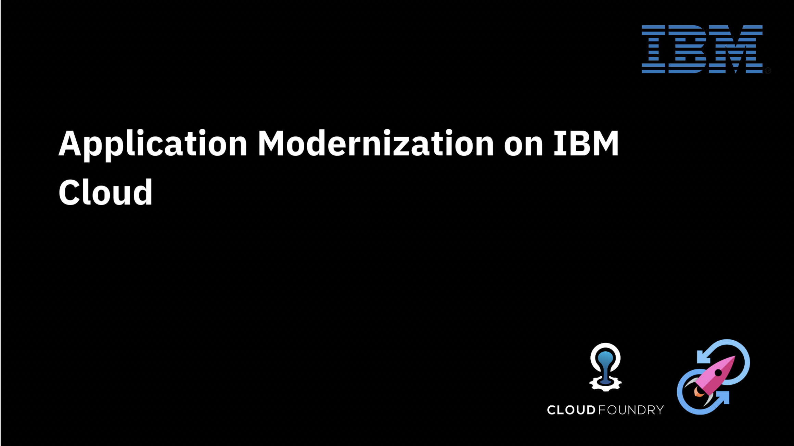

## Steps:
1. [Signup for IBM Cloud Platform and Fork the repository](#step-1-Signup-for-IBM-Cloud-Platform-and-Fork-the-repository)
1. [Login into your IBM account and search for CloudFoundry](#step-2-Login-into-your-IBM-account-and-search-for-CloudFoundry)
1. [Create Public Application](#step-3-create-Public-Application)
1. [Setup CloudFoundry service ](#step-4-Setup-CloudFoundry-service)
1. [Verify Cloud Foundry deployed successfully](#step-5-Verify-Cloud-Foundry-deployed-successfully )
1. [Enable Toolchain service for continuous integration and delivery](#step-6-Enable-Toolchain-service-for-continuous-integration-and-delivery)
1. [Finally application would be up and running](#step-7-Finally-application-would-be-up-and-running)

### Step 1. Signup for IBM Cloud Platform and Fork the repository

1. Create IBM Account: [Here](http://ibm.biz/cloudnative2020)
1. Open this [repo](https://github.com/mahsankhaan/app-modernization-using-IBM-toolchain.git)
1. And then click on __Fork__ on the top right 

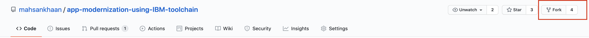

__NOTE:__ Kindly udpdate __manifest.yml__ file, open and change the __name__ filed to something unique. 

### Step 2. Login into your IBM account and search for CloudFoundry
IBM Cloud Login-link: [https://cloud.ibm.com/login](https://cloud.ibm.com/login)

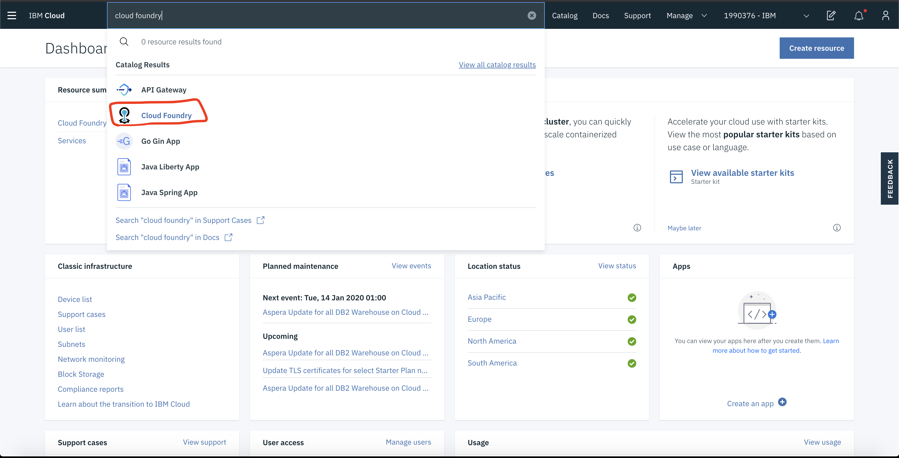

### Step 3. Create Public Application

### Step 4. Setup CloudFoundry service 

1. Select region "Dallas" and account type "lite".

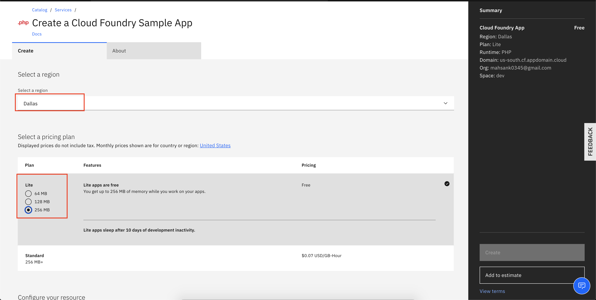

2. Select runtime __PHP__) 
3. App name: __Cloudnative-xyz__ (Please use different names)
4. Once everything is completed click __Create__

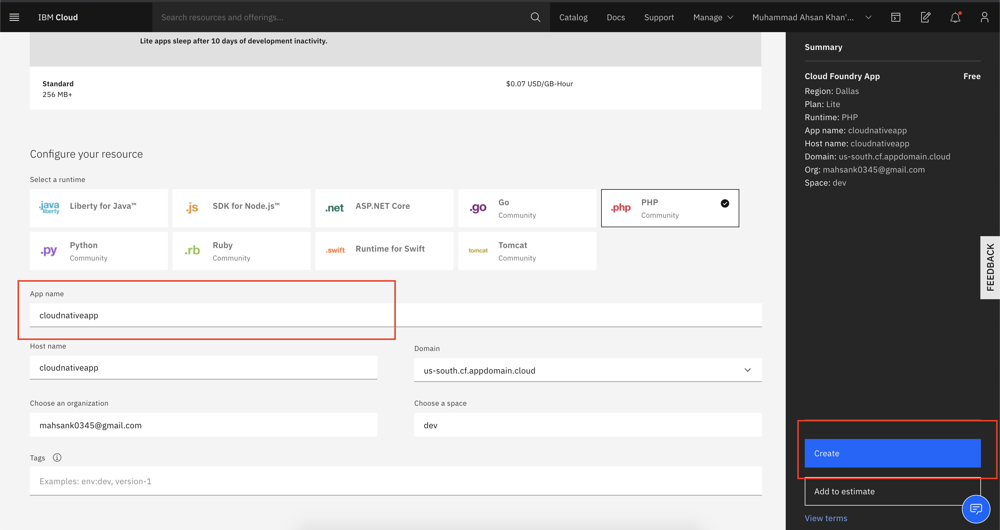

### Step 5. Verify Cloud Foundry deployed successfully 

Click __Visit App URL__ and a new browser tab will open on which our CF template is running.

### Step 6. Enable Toolchain service for continuous integration and delivery

1. Select __Overview__ from left menu under Cloud Foundry service
2. In Continuous delivery section select __Enable__ button.

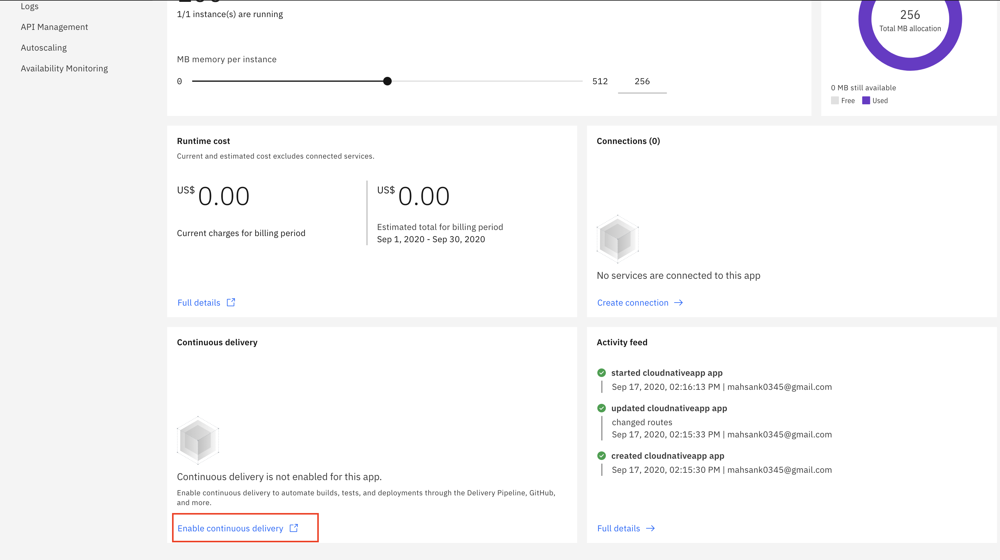

3. There will be Continuous Delivery Toolchain page.

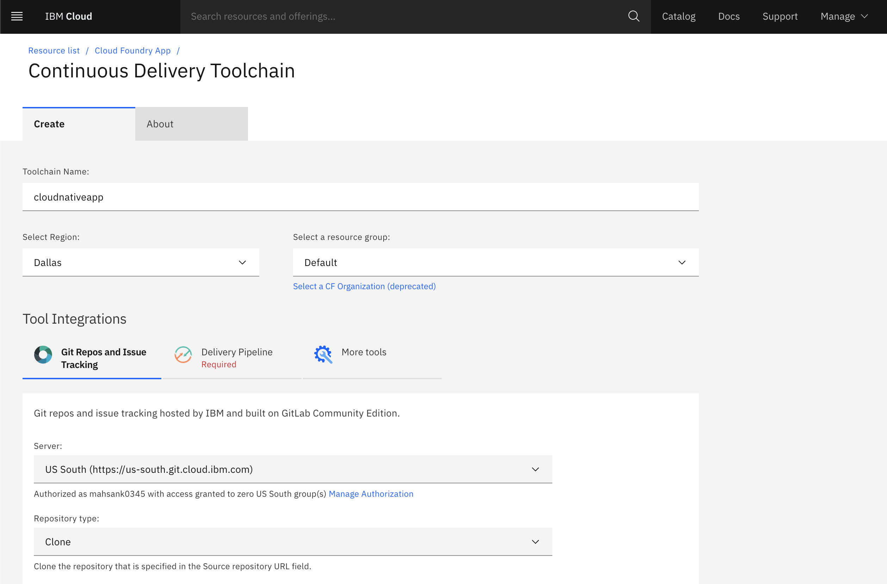

4. In Git repos section insert Source repository URL: 

__NOTE: Please use your fork repo [step 1](#step-1-Signup-for-IBM-Cloud-Platform-and-Fork-the-repository) or else you can't trigger the change__

[https://github.com/mahsankhaan/app-modernization-using-toolchain.git](https://github.com/mahsankhaan/app-modernization-using-toolchain.git)

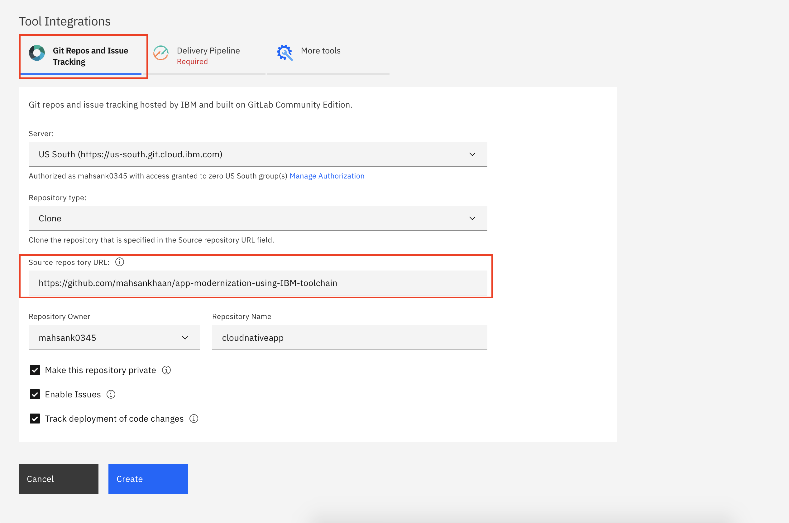

5. In Delivery Pipeline section , click "new" to generate API

6. Once everything is done press "Create" button

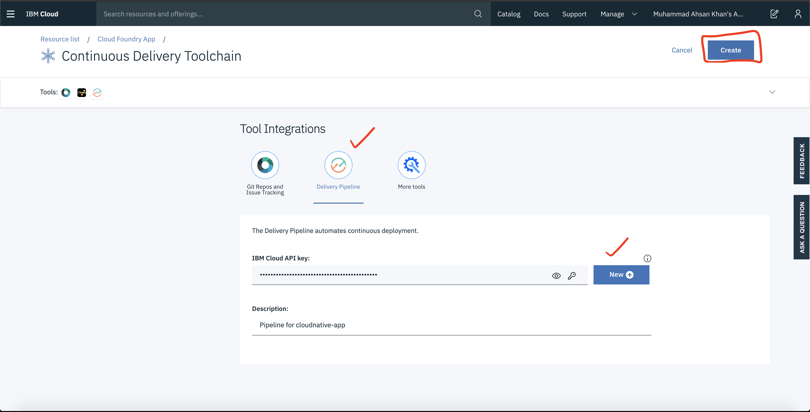

7. Now your toolchain is created and select "Delivery Pipeline"

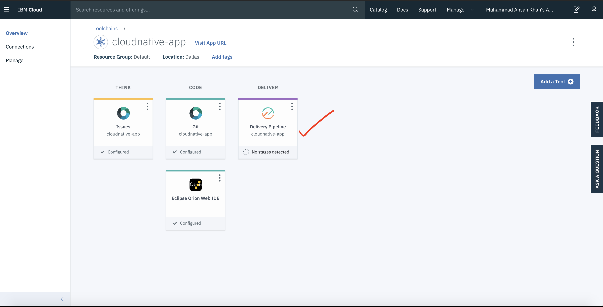

8. In __Delivery Pipeline__ start build stage
9. Wait until the __Build stage__ becomes green
10. After that __Delpoy stage__ will trigger and execute automatically 

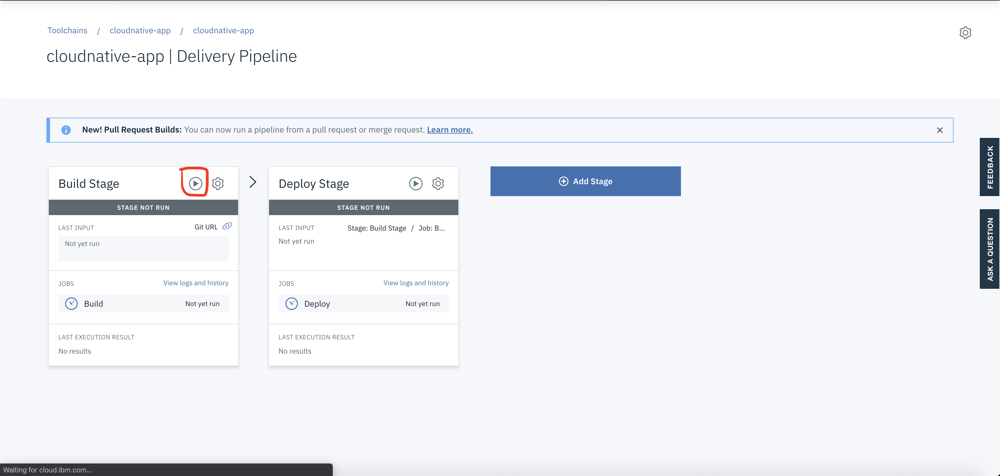

11. Once both the stages executed successfully they will be in green.

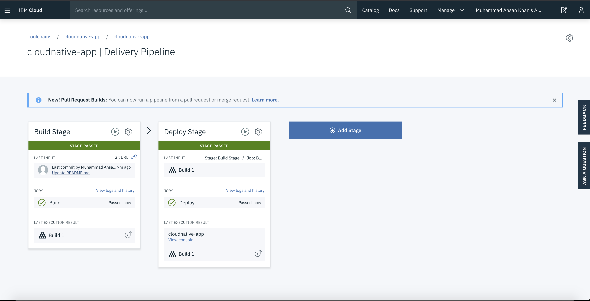

### Step 7. Finally application would be up and running

1. Get back to main page by selecting app name on top

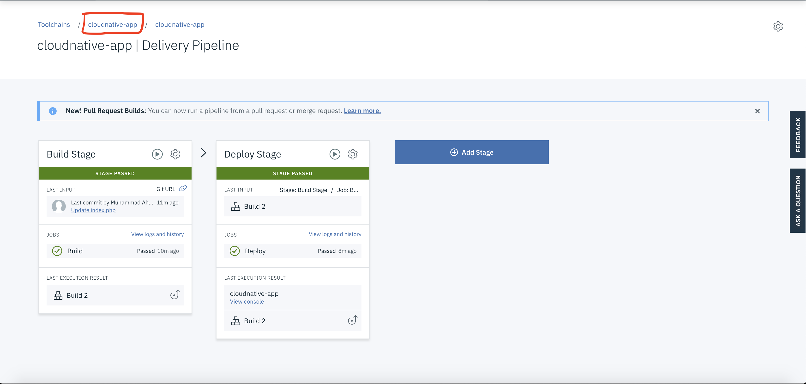

2. Click visit URL and see your app running

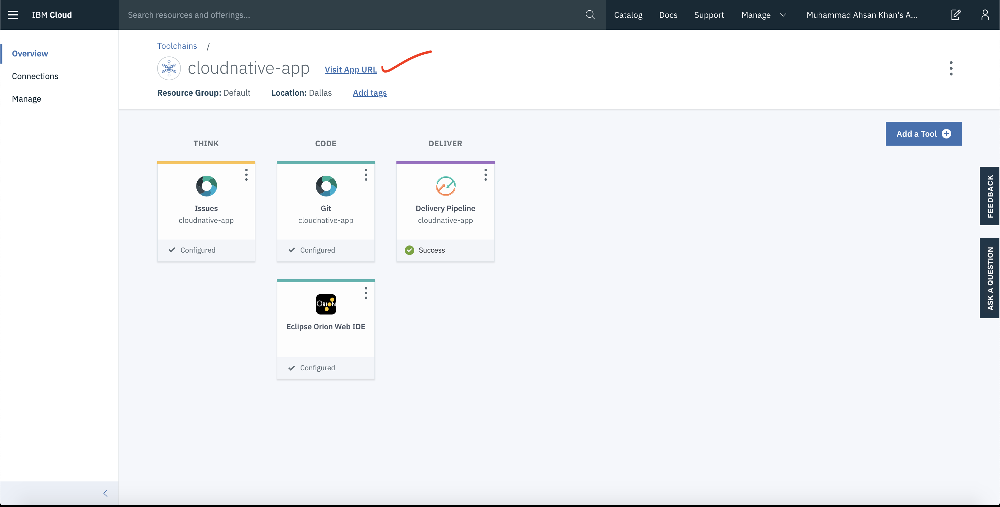

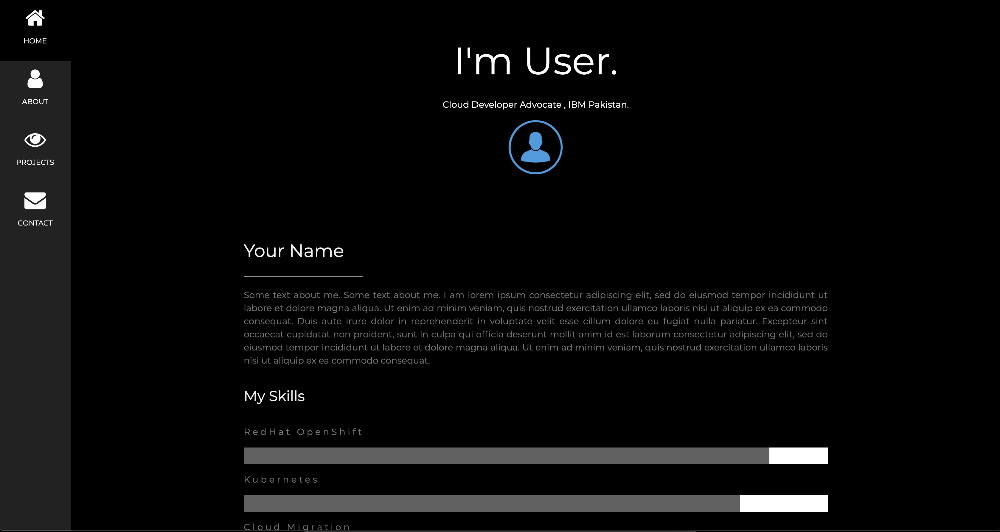

